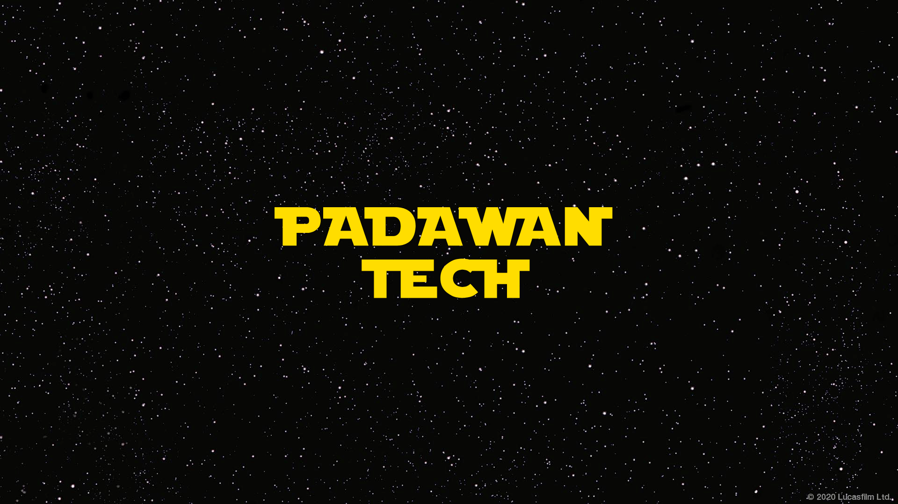

  

___
# PADAWAN TECH
O ponto de encontro para programadores em busca de novos desafios e empresas em busca de novos talentos.
 
___

Padawan Tech é um projeto do curso "Introdução a programação" da Proz tecnologia com apoio do Amzon AWS e Meta. Padawan Tech, é o lugar perfeito para os desenvolvedores apresentarem seus projetos e conectarem-se com empresas em busca de talentos. A plataforma é o ponto de encontro para programadores em busca de novos desafios e empresas em busca de novos talentos. 

___

O Projeto está sendo realizado por (Links Github):

* [Maria Dias (Bia)](https://github.com/biadiaz)
* [Leticia Gomes](https://github.com/leticia2925)
* [Kaio Pontes)](https://github.com/kaiopontes)
* [Jonathan Maia](https://github.com/jonathanppmaia)

___
### Ferramenta e Tecnologias Utilizadas

  
   
    
     
  
    

___

### Sprint - 01 Layout

##### Desenvolvimento :

* Desenvolver o layout de pelo menos 5 telas do site, uma vez que cada grupo terá em média 5 integrantes.

* Criar repositório remoto com todos os colaboradores do grupo com as referências do layout, que pode ser feito desde à mão até figma.

##### Organização :

* Uso do Github para gestão do projeto.
* Uso do Discord para comunicação da equipe.

Entrega em 05.04.2023 -  [LINK  PROJETO NO FIGMA ](https://www.figma.com/embed?embed_host=share&url=https%3A%2F%2Fwww.figma.com%2Ffile%2FkG5x8XurgI3tuNaYNH1yJu%2FPadawan-Tech---Sprint-01%3Fnode-id%3D0%253A1%26t%3D7vbDyQLGHKzTlnJh-1).

___

### Sprint - 02 HTML

##### Desenvolvimento :

* Uso apropriado das tags HTML para organização do conteúdo do site;

* Ter pelo menos 5 arquivos HMTL (um para cada layout criado anteriormente);

* Configurar o repositório criado pela equipe de trabalho.‌

##### Organização :

* Uso do Github para gestão do projeto.
* Uso do Discord para comunicação da equipe.

##### Ao final da Sprint:

* Projeto com os componentes básicos de um site:
* Header;
* Barra de navegação;
* Formulário;
* Seções e artigos;
* Footer.

Entrega em 12.04.2023

___

### Sprint - 05 Banco de Dados

Entrega da Sprint: https://docs.google.com/document/d/1uZGjGQyzUGWFYCXCRF_TkQEbEw10u96xcotRsLzDE-M/edit?usp=sharing
